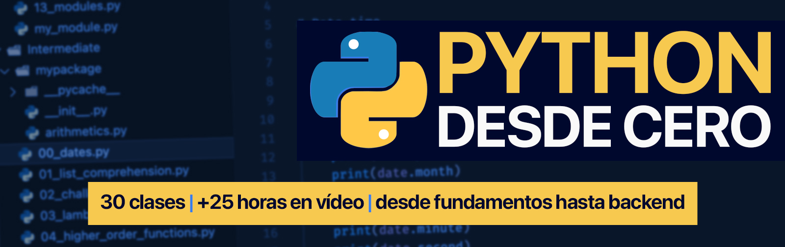
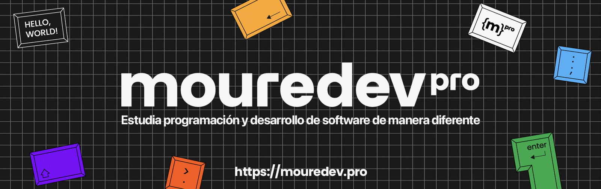

# Hello Python

## Curso para aprender el lenguaje de programación Python desde cero y para principiantes

### Proyecto realizado durante emisiones en directo desde [Twitch](https://twitch.tv/mouredev)

> ##### Si consideras útil el curso, apóyalo haciendo "★ Star" en el repositorio. ¡Gracias!

## Clases en vídeo

### Curso de fundamentos desde cero

Curso que agrupa todas las clases en directo que hacen referencia a los fundamentos de Python.

> Código: Directorio "Basic" en el proyecto

- [Introducción](https://youtu.be/Kp4Mvapo5kc)
- [Contexto](https://youtu.be/Kp4Mvapo5kc?t=244)
- [Lección 1 - Configuración](https://youtu.be/Kp4Mvapo5kc?t=850)
- [Lección 2 - Hola Mundo](https://youtu.be/Kp4Mvapo5kc?t=1518)
- [Lección 3 - Variables](https://youtu.be/Kp4Mvapo5kc?t=2938)
- [Lección 4 - Operadores](https://youtu.be/Kp4Mvapo5kc?t=5665)
- [Lección 5 - Strings](https://youtu.be/Kp4Mvapo5kc?t=8643)
- [Lección 6 - Listas](https://youtu.be/Kp4Mvapo5kc?t=10872)
- [Lección 7 - Tuplas](https://youtu.be/Kp4Mvapo5kc?t=14711)
- [Lección 8 - Sets](https://youtu.be/Kp4Mvapo5kc?t=16335)
- [Lección 9 - Diccionarios](https://youtu.be/Kp4Mvapo5kc?t=18506)
- [Lección 10 - Condicionales](https://youtu.be/Kp4Mvapo5kc?t=21442)
- [Lección 11 - Bucles/Loops/Ciclos](https://youtu.be/Kp4Mvapo5kc?t=23822)
- [Lección 12 - Funciones](https://youtu.be/Kp4Mvapo5kc?t=26619)
- [Lección 13 - Clases](https://youtu.be/Kp4Mvapo5kc?t=29327)
- [Lección 14 - Excepciones](https://youtu.be/Kp4Mvapo5kc?t=32030)
- [Lección 15 - Módulos](https://youtu.be/Kp4Mvapo5kc?t=34583)
- [Próximos pasos](https://youtu.be/Kp4Mvapo5kc?t=36390)

### Curso intermedio de fundamentos desde cero

Curso en el que continuamos aprendiendo Python desde sus bases, siguiendo la ruta de aprendizaje desde la última lección del curso de inicial.

> Código: Directorio "Intermediate" en el proyecto

- [Introducción](https://youtu.be/TbcEqkabAWU)
- [Lección 1 - Dates](https://youtu.be/TbcEqkabAWU?t=202)
- [Lección 2 - List Comprehension](https://youtu.be/TbcEqkabAWU?t=3239)
- [Lección 3 - Resolución de retos de programación](https://youtu.be/TbcEqkabAWU?t=4142)
- [Lección 4 - Lambdas](https://youtu.be/TbcEqkabAWU?t=9145)
- [Lección 5 - Funciones de orden superior](https://youtu.be/TbcEqkabAWU?t=10172)
- [Lección 6 - Tipos de error](https://youtu.be/TbcEqkabAWU?t=12721)
- [Lección 7 - Manejo de ficheros](https://youtu.be/TbcEqkabAWU?t=15524)
- [Lección 8 - Expresiones regulares](https://youtu.be/TbcEqkabAWU?t=19762)
- [Lección 9 - Manejo de paquetes](https://youtu.be/TbcEqkabAWU?t=24010)
- [Próximos pasos](https://youtu.be/TbcEqkabAWU?t=26228)

### Backend desde cero

Curso en el que aprenderemos a utilizar Python para backend e implementaremos un API REST con autenticación, base de datos y desplegaremos el proyecto en un servidor real.

> Código: Directorio "Backend" en el proyecto

- [Introducción](https://youtu.be/_y9qQZXE24A)
- [Lección 01 - ¿Qué es un backend?](https://youtu.be/_y9qQZXE24A?t=125)
- [Lección 02 - API y FastAPI](https://youtu.be/_y9qQZXE24A?t=834)
- [Lección 03 - Type Hints](https://youtu.be/_y9qQZXE24A?t=1810)
- [Lección 04 - Configuración FastAPI](https://youtu.be/_y9qQZXE24A?t=2629)
- [Lección 05 - Hola mundo](https://youtu.be/_y9qQZXE24A?t=3504)
- [Lección 06 - Operación GET](https://youtu.be/_y9qQZXE24A?t=5382)
- [Lección 07 - Peticiones HTTP](https://youtu.be/_y9qQZXE24A?t=5925)
- [Lección 08 - Creación API](https://youtu.be/_y9qQZXE24A?t=6099)
- [Lección 09 - Path y Query](https://youtu.be/_y9qQZXE24A?t=7510)
- [Lección 10 - Operaciones POST, PUT y DELETE](https://youtu.be/_y9qQZXE24A?t=8529)
- [Lección 11 - HTTP status codes](https://youtu.be/_y9qQZXE24A?t=11072)
- [Lección 12 - Routers](https://youtu.be/_y9qQZXE24A?t=12475)
- [Lección 13 - Recursos estáticos](https://youtu.be/_y9qQZXE24A?t=13618)
- [Lección 14 - Autorización OAuth2](https://youtu.be/_y9qQZXE24A?t=14094)
- [Lección 15 - OAuth2 JWT](https://youtu.be/_y9qQZXE24A?t=17664)
- [Lección 16 - MongoDB](https://youtu.be/_y9qQZXE24A?t=20480)
- [Lección 17 - MongoDB Atlas](https://youtu.be/_y9qQZXE24A?t=25470)
- [Lección 18 - Despliegue en Deta \*](https://youtu.be/_y9qQZXE24A?t=27335)
- [Próximos pasos](https://youtu.be/_y9qQZXE24A?t=28484)

**\*ACTUALIZACIÓN Sobre la lección 18:** Deta, el servicio utilizado para el despliegue durante el curso, ya no existe. Te recomiendo revisar la documentación oficial de FastAPI sobre [despliegue](https://fastapi.tiangolo.com/deployment/). Puedes utilizar alguno de los [proveedores gratuitos](https://fastapi.tiangolo.com/deployment/cloud/) recomendados. En mi caso, te dejo el [fichero de configuración](./Backend/FastAPI/vercel.json) para hacerlo desde [Vercel](https://vercel.com/) (al crear el proyecto en la plataforma selecciona que el directorio "Backend/FastAPI" es el root).

### Frontend desde cero

Cursos en los que aprenderemos a utilizar Python para desarrollo web con dos proyectos reales desplegados en producción. Tutoriales en vídeo paso a paso con 9 horas de contenido.

### Aprende a integrar ChatGPT en tu proyecto desde cero

Clase de una hora de duración donde aprenderás a interactuar con ChatGPT desde tu aplicación, mantener conversaciones y establecer el contexto de la IA para potenciar tu proyecto.

Con todo el código publicado [aquí](https://gist.github.com/mouredev/58abfbcef017efaf3852e8821564c011).

### Traductor de Voz con IA

Aprende a desarrollar un traductor de voz a varios idiomas utilizando con IA. Creando su Web y todo en 100 líneas.

Con todo el código publicado [aquí](https://gist.github.com/mouredev/0ea42112751f0187d90d5403d1f333e2).

### Introducción al Testing

Taller de introducción a testing con Python creado junto a [Carlos Blé](https://www.carlosble.com) y [Miguel A. Gómez](https://softwarecrafters.io), expertos en la materia.

### Extra: 15 curiosidades sobre Python

Y para finalizar... ¿Quieres saber aun más sobre él? Aquí tienes 15 curiosidades que quizás no conozcas sobre el lenguaje.

## Información importante y preguntas frecuentes

Actualmente el curso está en pausa. Se han finalizados los bloques básico, intermedio y backend, y ese era el objetivo inicial del proyecto.
No descarto añadir nuevas lecciones a futuro, pero creo que por el momento puede servir de base a cualquier persona que quiera empezar a aprender este lenguaje.

- Recuerda que he creado en el [Discord](https://discord.gg/mouredev) un canal "🐍python" para que puedas comentar lo que quieras.
- En el momento que el curso continúe, actualizaré el repositorio y avisaré en redes.

¡Muchísimas gracias por todo el apoyo mostrado!

## Enlaces de interés

- [Web oficial de Python](https://www.python.org/)
- [Tutorial oficial de Python en Español](https://docs.python.org/es/3/tutorial/index.html)
- [Repo 30 días de Python](https://github.com/Asabeneh/30-Days-Of-Python)
- [Juego Codédex para aprender Python](https://www.codedex.io/)
- [Visual Studio Code](https://code.visualstudio.com/): El editor que estoy usando
- [FastAPI](https://fastapi.tiangolo.com/es/): El framework para crear nuestra API Backend
- [MongoDB](https://www.mongodb.com/): La base de datos que utiliza nuestro backend
- [Vercel](https://vercel.com/): Para desplegar nuestra API en la nube

## Únete al campus de programación de la comunidad

#### Te presento [mouredev pro](https://mouredev.pro), mi proyecto más importante para ayudarte a estudiar programación y desarrollo de software de manera diferente.

> **¿Buscas un extra?** Aquí encontrarás este y otros cursos editados por lecciones individuales, para avanzar a tu ritmo y guardar el progreso. También dispondrás de ejercicios y correcciones, test para validar tus conocimientos, examen y certificado público de finalización, soporte, foro de estudiantes, reunionnes grupales, cursos exclusivos y mucho más.
>
> Entra en **[mouredev.pro](https://mouredev.pro)** y utiliza el cupón **"PYTHON"** con un 10% de descuento en tu primera suscripción.

##  Hola, mi nombre es Brais Moure.

### Freelance full-stack iOS & Android engineer

Soy ingeniero de software desde 2010. Desde 2018 combino mi trabajo desarrollando Apps con la creación de contenido formativo sobre programación y tecnología en diferentes redes sociales como **[@mouredev](https://moure.dev)**.

Si quieres unirte a nuestra comunidad de desarrollo, aprender programación, mejorar tus habilidades y ayudar a la continuidad del proyecto, puedes encontrarnos en:

 
 
